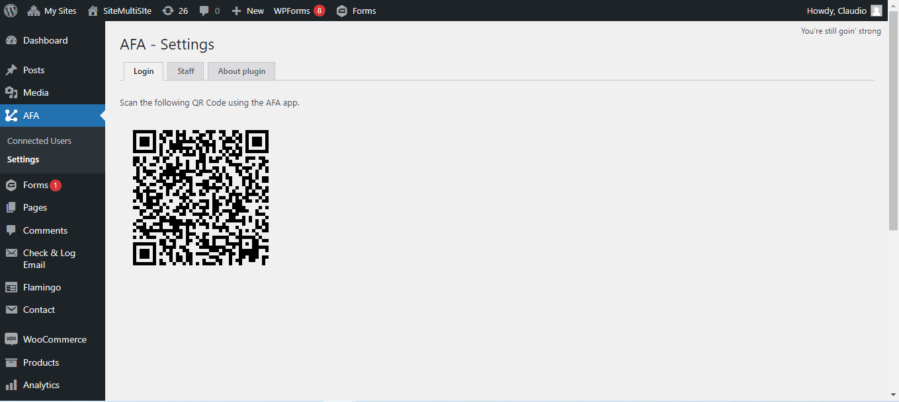

# afa-submission-manager
This is a plugin for querying data from various forms within the WordPress ecosystem.

Plugin Settings



Mobile App


# Setup Requirements
- [x] WordPress Instance - you can learn more <a href="https://wordpress.org/support/article/how-to-install-wordpress/">here</a>
- [x] Composer - you can learn more <a href="https://getcomposer.org/doc/00-intro.md">here</a>
# Installation
1. Clone the plugin directory into the `/wp-content/plugins/` directory.
```
git clone https://github.com/claudionhangapc/afa-submission-manager.git && cd afa-submission-manager
```
2. Install project dependencies using `composer install`
3. Activate the `WP All Forms API` plugin through the WordPress plugin administration page.
4. After activating the plugin on your machine, the access route will be formed by the site's base, `https://mysite.com`, for the API base `/wp-json/afa-submission-manager/v1`, and the endpoint, e.g.: `/ping`. Therefore, the route `https://mysite.com/wp-json/afa-submission-manager/v1/ping` allows you to check if the API is functioning correctly, returning a `{"ping": "pong"}` response.

# Plugins

The idea is to implement endpoints for various plugins, each with at least 50,000 active installations. Those marked with `ok` have already been implemented.
- [x] Contact Form 7
- [x] WPForms
- [x] Gravity Forms
- [x] weForms
- [x] Elementor Form 
- [ ] Ninja Forms
- [ ] Formidable Forms
- [ ] Everest Forms
- [ ] Metform Elementor Contact Form Builder 
- [ ] Forminator
- [ ] Contact Form Plugin – Fastest Contact Form Builder Plugin for WordPress by Fluent Forms
- [ ] The Divi Contact Form Module

## Donate
If you find this plugin useful, consider making a donation to support its development. [Donate here](https://www.paypal.com/donate/?hosted_button_id=PN2UZZWDZ4Y36).
